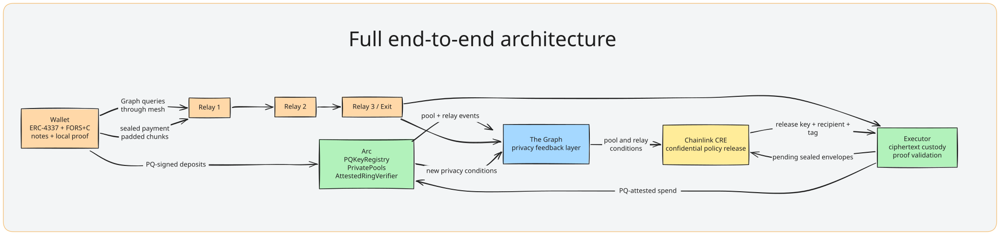

### Private USDC settlement for the quantum era

**Opaque is a post-quantum private settlement rail for USDC on Arc. It keeps four
linkages out of the settlement trail: wallet identity, payment timing, RPC/query
activity, and IP origin—coordinating key, spend, network, and release privacy in
one system.**

[Launch Opaque](https://www.opaque.credit/app.html) · [Install extension](extension/README.md#install-from-the-zip) · [Architecture](#architecture) · [Partners](partner-docs/README.md)

---

## Partner-wise READMEs
[The Graph](partner-docs/the-graph.md)
 · [Arc](partner-docs/arc.md)
 · [Chainlink](partner-docs/chainlink.md)

## The market gap

Most on-chain privacy systems protect only the final transaction. That leaves three earlier points of failure:

| Exposure | What breaks | Opaque’s answer |
|---|---|---|
| **Authorization** | A public elliptic-curve key can be harvested today and attacked later. | A FORS+C hash-based key controls an ERC-4337 smart account. |
| **Settlement** | A public transfer reveals the payer, recipient, and note linkage. | An eight-member hash-based MPC-in-the-head ring proves one eligible note was spent without naming it. |
| **Network origin** | RPCs and services can connect a wallet IP to a payment request. | Every wallet request uses a fresh three-hop ML-KEM onion path. |
| **Timing** | An immediate spend can be correlated with its funding event. | A confidential privacy window waits for stronger conditions or settles no later than the user’s deadline. |

**Our position:** Opaque is quantum-transition-ready private USDC infrastructure—not a privacy skin around a conventional wallet, and not a mixer that ignores network metadata.

## The confidential-payments market

Stablecoins are becoming the settlement layer for payroll, treasury movement,
merchant payouts, and cross-border value transfer. Those users need more than
a hidden calldata field: they need the payer’s authority, payment linkage,
execution time, and network origin to remain difficult to correlate.

Today’s confidential-payment options usually cover only one part of that
problem. A pool can hide the sending address while leaving RPC/IP metadata
visible; a conventional smart wallet can improve UX while retaining
elliptic-curve authorization; a privacy protocol can hide the transfer while
settling immediately into a predictable timing pattern. None provides one
coherent, post-quantum path from wallet authorization to network transport to
conditional settlement.

Opaque is built for that missing layer: **confidential USDC settlement that is
private at the key, transaction, timing, and network levels—and designed for
the day elliptic-curve cryptography can no longer be trusted.**

---

## The product in one payment

~~~text
USDC deposit → fixed-denomination private note → local 8-member ring
  → sealed payment → 3-hop relay mesh → confidential privacy policy
  → Arc pool settlement → fresh Graph signals for the next payment
~~~

<table>
<tr>
<td width="33%"><b>1. Own with a PQ key</b> The browser creates a local FORS+C key. It authorizes an ERC-4337 account through <code>PQKeyRegistry</code>; no ECDSA owner can rotate or drain it.</td>
<td width="33%"><b>2. Spend among eight</b> USDC becomes 1, 2, 5, 10, 20, 50, or 100 USDC notes. The wallet proves ownership of one same-value note among eight, locally.</td>
<td width="33%"><b>3. Release under conditions</b> Recipient, threshold, and deadline are sealed to Chainlink CRE. It releases early only when public privacy conditions are strong, or at the user’s latest-settlement deadline.</td>
</tr>
</table>

### What a private payment does—and does not—reveal

| Public on Arc | Kept private from the chain, RPC, and ordinary backend |
|---|---|
| A deposit is attributable by design. | Which eligible deposit supplied the private spend. |
| Pool denomination and the recipient at final settlement. | Sender identity, selected decoys, payment key, privacy threshold, and deadline. |
| Aggregate relay health and pool events. | Wallet IP, direct Graph query, and relay path. |

---

## Architecture

### Architecture diagrams

| Diagram | What it covers |
|---|---|
| [End-to-end architecture](diagrams/e2e.svg) | Wallet → ring → relay mesh → Graph → CRE → Arc settlement. |
| [Wallet and account authority](diagrams/wallet.svg) | ERC-4337 account flow, FORS+C authorization, and key lifecycle. |
| [Ring proof and note spend](diagrams/proof.svg) | Same-denomination ring construction, proof, nullifier, and pool spend. |
| [Graph privacy feedback loop](diagrams/graph.svg) | Intelligence signals, decoy/routing decisions, and feedback from settlement. |
| [CRE + Arc settlement](diagrams/cre-arc.svg) | Confidential policy release and Arc contract settlement path. |

| Layer | Crux | Technical implementation |
|---|---|---|
| **Quantum-safe authority** | A future quantum attacker should not turn a published account key into control of the wallet. | ERC-4337 v0.7 smart account; FORS+C signatures verified through Solidity and PQKeyRegistry; pre-committed rotation and bounded key use. |
| **Private settlement** | A pool pays the recipient without naming which note in an eight-member same-denomination set was opened. | Hash-based MPC-in-the-head ring proof, local note vault, one fresh nullifier, membership checks, and a post-quantum attestation gate. |
| **Network privacy** | Infrastructure should not see who asked to pay. | Three ML-KEM-768 onion layers, AES-256-GCM payload protection, padding, batching, delay, and operator-diverse paths. |
| **Privacy coordination** | Privacy is a condition, not a toggle. | The Graph’s Arc intelligence layer indexes public pool and relay signals; the wallet selects the strongest eligible decoys locally, while Chainlink CRE evaluates the sealed threshold/deadline policy. |

### The Graph closes the feedback loop

The Graph is Opaque’s **privacy coordination layer—the brain of Opaque’s privacy mechanism.** It helps the wallet select the strongest eligible decoys locally.

~~~text
ring signals: pool population · note age · ring reuse · concentration
mesh signals: reliability · batch occupancy · recent selection count · operator diversity
       ↓
local decoy selection + local Markov route policy + CRE release score
       ↓
settlement produces fresh signals for the next payment
~~~

The Graph Client composes that operational Arc state with an independent
standardized Arbitrum USDC context, and Privacy Sentinel exposes the combined
aggregate view through MCP. Read the full integration in [The Graph partner write-up](partner-docs/the-graph.md).

### Privacy Sentinel: the inspectable Graph product

Privacy Sentinel is the public interface to that composition. It publishes
aggregate ring readiness, mesh health, indexed-block freshness, and external
USDC context through a typed MCP surface—enough for a judge or agent to inspect
why privacy conditions are strong or weak, without exposing a user’s note,
recipient, route, or identity.

[Open Privacy Sentinel](https://opaque-production.up.railway.app/healthz) · [MCP endpoint](https://opaque-production.up.railway.app/mcp)

---

## Partner integrations

| Partner | What is live | Why it is core |
|---|---|---|
| **Arc + Circle** | USDC settlement, USDC gas, ERC-4337 accounts, seven denomination pools, CCTP V2 entry from Sepolia. | The product is programmable private USDC on Arc—not a token adapter. |
| **Chainlink CRE** | Active opaque-confidential-release workflow in AWS Nitro; Vault DON secrets; 30-second confidentiality policy ticks. | CRE is the authority that can release a sealed payment under the payer’s conditions. |
| **The Graph** | Arc intelligence layer for wallet/CRE coordination, plus a typed Graph Client composition with an independent Arbitrum USDC context and Privacy Sentinel MCP. | It makes privacy adaptive across payments and gives judges a reusable, inspectable Graph product—not a one-off query. |

[Arc + Circle details](partner-docs/arc.md) · [Chainlink CRE details](partner-docs/chainlink.md) · [The Graph details](partner-docs/the-graph.md)

---

## Live evidence

| Surface | Evidence |
|---|---|
| **Wallet** | [opaque.credit/app.html](https://www.opaque.credit/app.html) and [browser extension](extension/README.md#install-from-the-zip) |
| **Arc testnet** | Chain ID 5042002 · [Explorer](https://testnet.arcscan.app) · [deployment registry](deployments/arc-testnet.json) |
| **Graph** | [opaque/v0.3.0 Subgraph Studio query endpoint](https://api.studio.thegraph.com/query/1760100/opaque/v0.3.0) |
| **Privacy Sentinel** | [Health](https://opaque-production.up.railway.app/healthz) · [MCP](https://opaque-production.up.railway.app/mcp) |
| **Backend** | [stack.json](https://opaque-stack-production.up.railway.app/stack.json) |
| **CRE** | opaque-confidential-release · workflow ID 003e31eff41f5e26b3a5c7414efba42245ba4687550a43986e15e51e4e71686e |
| **Contracts** | [Arc deployment map](deployments/arc-testnet.json), verified in chain deployment tests |

### Core contracts on Arc testnet

| Contract | Address | Role |
|---|---|---|
| PQKeyRegistry | [0x6eb5…8e8f](https://testnet.arcscan.app/address/0x6eb5b42373191121d31dfc4b5c8571c4eaf58e8f) | PQ key registration, use budget, and rotation |
| PQAccountFactory | [0x13be…b214](https://testnet.arcscan.app/address/0x13beaec42922e3f63fa0dbe5bba270edf46ab214) | Counterfactual ERC-4337 accounts |
| RelayDirectory | [0xcf58…6653](https://testnet.arcscan.app/address/0xcf588b5b8ab2fa11ccf28a5c0631da4269a36653) | Relay identity and health events indexed by The Graph |

---

## Security model, stated plainly

| Boundary | Enforced by | What it prevents |
|---|---|---|
| Account authority | PQKeyRegistry + PQ account validator | Conventional wallet key takeover and unauthorized rotation. |
| One spend per note | Pool nullifier state | Double-spending. |
| Ring eligibility | Pool membership validation | Synthetic/unknown decoy memberships. |
| Payment release terms | CRE envelope + MAC-bound decision | A backend altering recipient, privacy threshold, or deadline. |
| Route authority | Signed pinned relay directory | A Graph query inventing a relay identity or key. |
| Early release | Fresh, healthy Graph observations | Treating a stale or broken index as strong privacy. |

The current V1 proof verifier is split: the hash-based MPC-in-the-head proof is checked by the attester, while Arc enforces denomination, ring membership, one-time nullifier use, recipient binding, and the live post-quantum attestation. See the module contracts in [docs/interfaces.md](docs/interfaces.md).

---

## Repository map

~~~text
frontend/                  wallet + browser extension experience
packages/pq-wallet/        FORS+C signer and ERC-4337 SDK
packages/ring-client/      note vault and local decoy selection
backend/mesh/              ML-KEM onion transport, relay policy, Graph clamping
backend/zk/                hash-based MPC-in-the-head ring proof
backend/cre/               sealed intents, release policy, settlement
opaque-cre/                deployed Chainlink CRE confidential workflow
graph/                     Arc subgraph, Graph client, Markov and score policies
contracts/src/opaque/      accounts, registry, pools, verifier, relay directory
deployments/               deployed Arc testnet addresses and start blocks
diagrams/                  architecture diagrams used throughout this README
~~~

## Run and verify

Opaque uses **Bun** for package installation, scripts, and tests.

~~~bash
git clone https://github.com/minrawsjar/Nonce0.git
cd Nonce0

for dir in packages/protocol-types packages/pq-wallet packages/ring-client graph backend frontend; do
  (cd "$dir" && bun install)
done

(cd graph && bun test)
(cd backend && bun test)
(cd frontend && bun test)
(cd contracts && forge test)
~~~

For all implementation and deployment instructions, start at [docs/README.md](docs/README.md). For protocol interfaces, read [docs/interfaces.md](docs/interfaces.md).

---

Built for ETHOnline 2026 · [Architecture docs](docs/README.md) · [Partner docs](partner-docs/README.md) · [MIT License](LICENSE)

