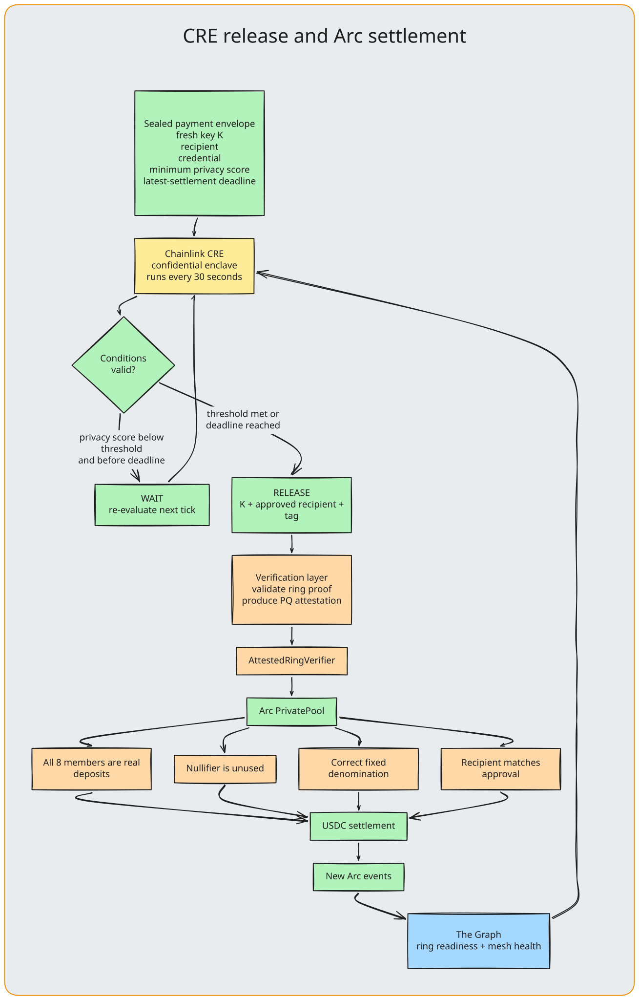

<div align="center">

# Opaque × Chainlink CRE

### Confidential policy release for private USDC settlement.

[](../opaque-cre/)

**Chainlink CRE is where Opaque evaluates a payer’s sealed privacy policy without handing those terms to the ordinary backend, and enforces settlement on Arc**

</div>



> **Track:** Best Confidential Workflow, Chainlink

Opaque's payments are sealed to a key that exists only inside a Chainlink CRE enclave. The workflow `opaque-confidential-release` runs every 30 seconds in the enclave, opens each waiting payment, and decides whether it goes now, waits for a stronger privacy set, or is refused. The server holding a pending payment cannot read its recipient; it receives that payment's key only after CRE authorizes release.

## What We Built

A private USDC payment on Arc is hidden among eight same-denomination deposits in a ring. Sent the moment it is signed, it can still be matched to its deposit by timing. So the payer can ask the payment to wait until the pool is strong enough, with a deadline. Those terms, and the recipient, are the sensitive inputs. They go to the enclave and nowhere else.

```
Wallet: "Send 5 USDC to 0xabc…", wait for stronger privacy, settle by 18:00
  → Encrypt the payment under a fresh key K
  → Seal {K, recipient, credential, pool, minimum score, deadline}
      to the CRE key with ML-KEM-768
  → Send both through the relay mesh to the executor, which cannot open either
  → CRE enclave, next tick (every 30 s):
      GET the pending list from the executor
      Query The Graph for every pool's size and the relays' health
      Open each envelope with the key derived from the Vault DON seed
      Decide on the payer's own sealed terms: WAIT, RELEASE or DENY
      POST the decisions back, each tagged under a shared secret
  → On RELEASE: the executor opens the payment with K, checks it pays the
      recipient the enclave approved, verifies the proof, and settles on Arc
```

## Deployment Evidence

| | |
|---|---|
| **Workflow** | `opaque-confidential-release` |
| **Workflow ID** | `003e31eff41f5e26b3a5c7414efba42245ba4687550a43986e15e51e4e71686e` |
| **Status** | `ACTIVE` |
| **Registry** | Chainlink-hosted private registry |
| **Enclave** | AWS Nitro, `us-west-2`, pinned in `handlerInTee` |
| **Vault DON secrets** | `INTENT_KEY_SEED`, `CREDENTIAL_MAC` |
| **Executions** | `SUCCESS` every 30 seconds; the last 20 listed on 11 September 2026 all succeeded |
| **Backend report** | [`stack.json`](https://opaque-stack-production.up.railway.app/stack.json) reports `"confidentialExecution": "ATTESTED"` |
| **Payments after deploy** | [`0xfef2a562…d547`](https://testnet.arcscan.app/tx/0xfef2a5629d50afcc30a8573d7808c61d998137c0c740f94b4abc17b4b062d547) and [`0xa186e835…c823`](https://testnet.arcscan.app/tx/0xa186e83554cb342d71bc9fc4faca33394db93565e324b666953964ab99e1c823), settled after the enclave released them |

Check it yourself:

```bash
cd opaque-cre
cre workflow list --target staging-settings --output json
cre execution list opaque-confidential-release --target staging-settings
```

## CRE Features Used

| Feature | Where | Purpose |
|---|---|---|
| `handlerInTee` | `workflow.ts` | Registers the handler to run in the enclave, pinned to `{ tee: 'nitro', regions: ['us-west-2'] }` so a wider list is a code review, not a silent change |
| `TeeRuntime` | `onTick` | The runtime handed to a confidential handler |
| `CronCapability().trigger` | `initWorkflow` | Wakes the enclave every 30 seconds, CRE's minimum |
| `HTTPClient.sendRequest` | `onTick` | Three kinds of call, all made from inside the enclave, with `cacheSettings: { store: false }` |
| `runtime.getSecret` | `onTick` | Releases the ML-KEM seed and the MAC from the Vault DON into the enclave |
| `runtime.now()` | `onTick` | The time deadlines are judged against |
| `cre workflow simulate` | `bun run simulate` | One real tick against the live executor, with secrets from a local file |
| `cre secrets create` | `secrets.live.yaml` | Puts the two secrets in the Vault DON; the file holds names only |
| `cre workflow deploy` | private registry | Deploys with the logged-in account: no wallet, no gas |

## How We Meet the Criteria

**A CRE workflow using Confidential Workflows for real functionality.** The workflow is the only thing that can release a payment. The executor runs with `CRE_MODE=workflow` and refuses any payment not sealed to the CRE key, so without the enclave nothing settles.

**A registered TEE handler.** `handlerInTee(new CronCapability().trigger({ schedule }), onTick, [{ tee: 'nitro', regions: ['us-west-2'] }])`.

**Sensitive inputs processed in the enclave.** Four of them:

- The **ML-KEM-768 seed** (`INTENT_KEY_SEED`). The 2,400-byte decapsulation key is derived from it inside the enclave and never exists anywhere else.
- Every **opened envelope**: the recipient, the recipient's credential, the payment key K, the minimum privacy score and the deadline.
- The **credential MAC** (`CREDENTIAL_MAC`), which checks recipient credentials and tags each decision.
- The **decision itself**, computed on the payer's sealed terms. The executor never learns a deadline it could rewrite.

**Core to the project.** Every payment sent from opaque.credit or the extension goes through the enclave. It is not a side demo.

**Successful execution, with evidence.** Deployed and active, with executions succeeding every 30 seconds and payments settled on Arc after release. See the table above.

## What Is and Is Not Confidential

| Confidential | Not confidential |
|---|---|
| The two Vault DON secrets | **The workflow logic.** The binary is given to the Workflow DON; the enclave protects data, not code |
| Every opened envelope: recipient, credential, K, terms | The cron trigger |
| The bodies of the HTTP calls, made from inside the enclave | The return value, so it carries counts only |
| Each payer's minimum score and deadline | Logs, so the handler logs nothing |

The executor holds only the CRE **public** key. It can read a payment only after the enclave releases that payment's K, and only that one.

## Why the Work Is Split

CRE decides; the Railway executor carries. The split follows CRE's service limits, not preference.

| CRE limit | What we did |
|---|---|
| HTTP response of 100 KB; a ring proof is 1.1 MiB | The proof never enters CRE. The executor verifies it at full strength before its attester signs. |
| HTTP trigger: one request per 60 seconds, 10 KB | CRE polls on a cron trigger instead of receiving each payment |
| 5 HTTP calls per execution | One pending read, one Graph read, up to three posts of 20 decisions each. The rest wait a tick. |
| A secret holds 2 KB; an ML-KEM-768 key is 2,400 bytes | The Vault holds the 64-byte seed and the enclave derives the key |
| No state between executions | The executor keeps the pending list; each tick decides from the envelopes alone |

Settlement still goes through the executor's egress, because the executor is what verified the proof. Arc testnet now has a KeystoneForwarder, so the final write could move into the workflow; it needs a small receiver contract in front of the pools.

The executor can still delay or drop a payment. It cannot read, redirect or hurry one: the recipient is bound into the proof and checked against the enclave's decision, and the timing comes from sealed terms.

## Architecture

```
┌────────────────────────────┐                  ┌──────────────────────────────┐
│ EXECUTOR (Railway)         │                  │ CRE ENCLAVE (AWS Nitro)      │
│                            │  GET pending     │                              │
│ holds, cannot open:        │ ───────────────▶ │ every 30 s                   │
│  · payment under K         │                  │                              │
│  · envelope for CRE key    │                  │ Vault DON → INTENT_KEY_SEED  │
│                            │  POST decisions  │           → CREDENTIAL_MAC   │
│ on a tagged RELEASE:       │ ◀─────────────── │                              │
│  open with K, check the    │                  │ open · score · decide        │
│  recipient, verify proof,  │                  └──────────────┬───────────────┘
│  attest, settle on Arc     │                                 │ pool sizes,
└────────────────────────────┘                                 │ relay health
                                                ┌──────────────▼───────────────┐
                                                │ THE GRAPH (Subgraph Studio)  │
                                                └──────────────────────────────┘
```

## Source Code

| File | Purpose |
|---|---|
| [`opaque-cre/confidential-intent/workflow.ts`](../opaque-cre/confidential-intent/workflow.ts) | The TEE handler: cron trigger, three HTTP calls, `decide` |
| [`opaque-cre/confidential-intent/config.staging.json`](../opaque-cre/confidential-intent/config.staging.json) | Executor URL, subgraph URL, pinned relays, key id, policy version |
| [`opaque-cre/tools/make-keys.ts`](../opaque-cre/tools/make-keys.ts) | The key ceremony |
| [`backend/cre/cre-release.ts`](../backend/cre/cre-release.ts) | The decision, shared by the enclave, the local stand-in and the tests |
| [`backend/cre/sealed-intent.ts`](../backend/cre/sealed-intent.ts) | Envelope format and ML-KEM key derivation |
| [`backend/cre/seal-client.ts`](../backend/cre/seal-client.ts) | What the wallet runs to seal a payment |
| [`backend/cre/settler.ts`](../backend/cre/settler.ts) | What the executor does with a decision |
| [`backend/cre/test/cre-release.test.ts`](../backend/cre/test/cre-release.test.ts) | The decision's tests, including forged tags and wrong recipients |

## Product Feedback for Chainlink

### What worked well

- **`handlerInTee` is small.** It wraps an ordinary trigger and callback, so the same decision code runs in the enclave, in the local stand-in and in our tests.
- **The private registry** deploys with the logged-in account. No wallet, no gas, and active at once.
- **The Vault DON** kept our key off every server we run. The executor never holds a CRE secret.
- **Simulation against live endpoints** let us run real ticks against the real executor before deploying.

### Where we lost time

- **The first ticks after deploy failed in 0 ms**, with no reason given, and then started succeeding on their own. We first read it as missing Confidential Workflows access. A status that said "enclave starting" would have saved us a wrong diagnosis.
- **Secrets hold 2 KB.** A post-quantum decapsulation key does not fit, so we store a seed and derive the key. A key type for KEM keys in the Vault would help every post-quantum workflow.
- **The HTTP trigger allows one request a minute.** A payment system wants push, so we poll on a cron instead, which adds up to 30 seconds to every payment.
- **Logs leave the enclave**, so a confidential handler has to run blind in production. Counters that are safe to emit from a TEE would make one debuggable.
- **CLI details:** `cre secrets list` needs `--yes` without a TTY; `cre workflow deploy --output` rejects paths over 97 characters; `cre whoami` sometimes failed credential validation and passed on retry.

### Suggestions

- A documented way for an outside service to check that a response came from an attested enclave. We tag decisions with a secret shared through the Vault instead.
- More than one TEE region, so a privacy workflow does not depend on one data centre.

## Future Plans with Chainlink

1. **Settle through CRE directly.** Arc testnet now has a KeystoneForwarder, so a released payment can be written by the workflow instead of the executor's egress. [`CREPolicyGate`](../contracts/src/opaque/cre/CREPolicyGate.sol) and [`CREAuthorizedPool`](../contracts/src/opaque/pool/CREAuthorizedPool.sol) are already written for a CRE-settled path.
2. **Verify the ring proof in the enclave**, streamed across executions, removing the separate attester from the trust model.
3. **Real compliance credentials** fetched through Confidential HTTP from an issuer, instead of the test authority.
4. **Push instead of poll** when the HTTP trigger allows it, cutting the wait before a decision.

## Why Opaque and Chainlink CRE

A private payment has to be held by someone before it settles. Every design we considered put that someone on an ordinary server, able to read recipients or to time releases so they could be matched. CRE's enclave is the first place we could put the decision where the operator of the system cannot see it, while the code stays public for anyone to check. That is the part of Opaque you have to trust, and it is the part that runs on Chainlink.
