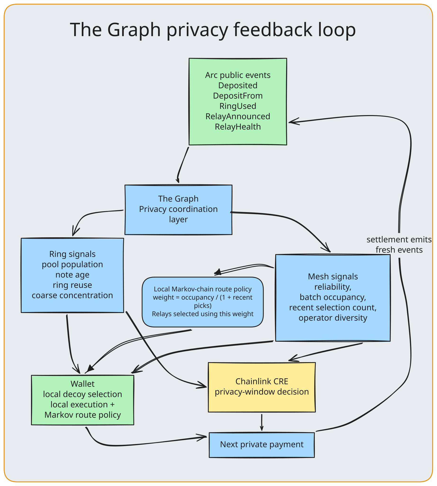

<div align="center">

# Opaque × The Graph

### Privacy coordination for post-quantum private settlement

**The Graph orchestrates Opaque’s complete privacy setup. It is the privacy coordination layer—the brain of Opaque’s privacy mechanism—turning live public conditions into better decoys, stronger relay paths, and smarter settlement timing.**

</div>



<div align="center">

[`Live Arc subgraph`](https://api.studio.thegraph.com/query/1760100/opaque/v0.3.0) · [`Privacy Sentinel`](https://opaque-production.up.railway.app/healthz) · [`MCP endpoint`](https://opaque-production.up.railway.app/mcp) · [`Schema`](../graph/schema.graphql) · [`Graph Client composition`](../graph/companion)

</div>

---

## Composed live Graph infrastructure

Opaque ships two connected Graph products. The **Privacy Intelligence Layer**
turns live Arc events into the signals that coordinate every private payment;
the **Privacy Sentinel MCP** makes that same composed context inspectable by
judges, agents, and developers.

```text
Arc Studio ───────────────────────┐
                                 ├─→ Graph Client ─→ Privacy Sentinel ─→ /mcp
Arbitrum USDC Graph source ──────┘
```

The Graph Client is the composition boundary between them. It joins Opaque’s
operational Arc source with an independent public USDC context, while keeping
the payment rail’s private choices local. In real time it answers: **are the
public conditions that give an Opaque payment cover actually strong right now?**

| Product | Role | Interface |
|---|---|---|
| **Privacy Intelligence Layer** | Produces versioned ring, mesh, and settlement-readiness signals used by wallet, mesh, and CRE. | [`graph/`](../graph) |
| **Privacy Sentinel MCP** | Publishes the composed, aggregate-only context for inspection and automation. | [`/mcp`](https://opaque-production.up.railway.app/mcp) |

---

## Opaque’s privacy intelligence layer

Most privacy systems make one payment private in isolation. Opaque uses The
Graph to learn from the public environment around every payment, so the next
one can enter a deeper ring, take a less predictable route, and settle under
stronger cover.

This makes Opaque **network-adaptive by design**. When pool composition or relay
conditions shift, the wallet and mesh do not keep using stale choices: Graph
signals are re-read, decoys are re-ranked, relay transitions are recomputed,
and CRE evaluates the current readiness state.

```text
Arc events ─→ Opaque Studio ─→ privacy coordination signals
                                      ├─ wallet ranks best eligible decoys
                                      ├─ mesh makes a diverse Markov route
                                      └─ CRE evaluates the privacy window
                                                   ↓
                                             next settlement
                                                   ↓
                                      fresh public events close the loop
```

The Graph is not a reporting layer. It is the shared state that makes Opaque’s
ring, mesh, and settlement mechanisms adapt together.

| Privacy mechanism | Graph signal | What improves |
|---|---|---|
| Eight-member ring | Same-denomination depth, ring reuse, coarse concentration, note age. | The wallet ranks the strongest eligible seven decoys locally. |
| Three-hop relay mesh | Reliability, batch occupancy, recent selection pressure, operator diversity. | A local Markov walk builds a less predictable path. |
| Conditional settlement | Versioned ring and mesh readiness. | CRE settles as soon as privacy is strong, or at the payer’s deadline. |

---

## Independent Arbitrum context layer

The Arc subgraph is the operational source of truth for Opaque. We deliberately
add a second, independent Graph Network source: a standardized Arbitrum USDC
subgraph. It contributes broad public transfer activity and indexed-block
freshness, not private Opaque state.

This is useful in three concrete ways: it gives the Sentinel an external
liveness baseline, demonstrates that the same typed composition works across
chains, and lets judges inspect a meaningful cross-protocol data product rather
than a single bespoke query. The independent signal is reported alongside Arc
readiness, so a stale Arc index or a quiet external market is visible instead
of being silently folded into one score.

```text
Arc Studio (operational Opaque state) ─┐
                                      ├─→ Graph Client ─→ Privacy Sentinel / MCP
Arbitrum USDC (independent context) ──┘
```

| Graph product | Opaque use | Evidence |
|---|---|---|
| **Arc Subgraph Studio** | Live pool, ring, and relay events power the operational intelligence layer. | [`opaque/v0.3.0`](https://api.studio.thegraph.com/query/1760100/opaque/v0.3.0) |
| **Arbitrum USDC Graph source** | Independent standardized context for liveness and public activity; it cannot authorize or settle Opaque payments. | [Graph Network](https://thegraph.com/explorer) |
| **The Graph Client** | Typed composition boundary joining both sources into one schema-safe context. | [`graph/companion`](../graph/companion) |
| **Privacy Sentinel MCP** | Serves the composed context to judges, agents, and developers. | [`/mcp`](https://opaque-production.up.railway.app/mcp) |
| **Substreams** | Reusable EVM module emits the same aggregate privacy-signal contract from pool and relay events. | [`indexer/privacy-signals`](../indexer/privacy-signals) |

This is a native Graph composition: Arc Studio remains Opaque’s operational
privacy source of truth; Arbitrum supplies an independent contextual signal;
Graph Client composes both; and Privacy Sentinel exposes the combined public
context. The independent context enriches inspection but never controls an
Opaque payment.

### Why Arbitrum is intentional

Using Arbitrum keeps the second product independent from the Arc deployment it
is helping explain. It gives us a standardized, high-activity USDC dataset to
exercise the same typed composition boundary, while making it impossible for
the independent source to quietly feed back private payment facts. If Arc
indexing is delayed or degraded, the Sentinel reports that separately instead
of treating one provider’s view as ground truth.

---

## Privacy Sentinel MCP product

Privacy Sentinel makes Opaque’s privacy intelligence directly inspectable. It
builds a typed public context from two live Graph query surfaces:

```text
OpaquePublicContext                 SettlementPublicContext
Studio / Arc                        Graph Network / Arbitrum USDC
├─ pool + ring signals              ├─ indexed block freshness
└─ relay health + diversity         └─ public transfer context
                 │                         │
                 └────── Graph Client ─────┘
                               ↓
                    combined public context
                               ↓
                     Privacy Sentinel / MCP
```

| Context signal | Meaning |
|---|---|
| `privacyScore` | The weaker of ring freshness and mesh health—the privacy layer is only as strong as its weakest side. |
| `ringFreshness` | Whether same-denomination cover is deep enough for an eight-member ring. |
| `meshHealth` | Whether reliable, operator-diverse relays are available for a three-hop path. |
| `contextStatus` | Whether the combined context is current, degraded, or stale. |
| `settlementStatus` | Whether the independent Arbitrum public context is current, stale, or unavailable. |
| `recentTransfers` | A bounded liveness signal from the independent public USDC source. |

The public MCP interface provides three direct views of this model:

| Tool | Returns |
|---|---|
| `get_privacy_context` | Current aggregate ring, mesh, and independent external context. |
| `explain_privacy_readiness` | Why observed privacy conditions are strong, weak, or stale. |
| `list_public_privacy_signals` | The signal families Opaque uses to coordinate privacy. |

Judges can inspect the conditions that improve Opaque’s decisions without
needing to reproduce or disclose a user payment.

---

## How Graph strengthens every layer

### Better decoys, not blind randomness

For each fixed-denomination payment, the wallet reads the relevant public pool
snapshot and ranks eligible candidates by low reuse, low coarse concentration,
healthy activity, and age diversity. It selects the best seven candidates
locally; the real note never leaves the wallet.

```text
same-denomination pool
        ↓
discard exhausted / invalid candidates
        ↓
rank by reuse · concentration · activity · age diversity
        ↓
7 best eligible decoys + local note = 8-member ring
```

### Adaptive mesh diversity

Relay health is not a static allowlist. The wallet uses Graph-indexed occupancy
and selection pressure in a local Markov policy:

```text
weight(relay) = batch occupancy / (1 + recent selection count)

hop 1 → best eligible transition
hop 2 → eligible transition with a different operator
hop 3 → eligible transition with a third operator
```

Active cover traffic receives positive weight, while an overused relay or
operator loses relative priority and cannot become a repeatable fingerprint.
This is the mechanism that turns public Graph telemetry into a network-adaptive
privacy path rather than a fixed three-hop route.

### Privacy as a measurable settlement condition

CRE evaluates the same versioned public policy used by the wallet:

```text
ringFreshness = min(10000, poolSize × 10000 / 8)
meshHealth    = min(relay capacity, mean reliability)
privacyScore  = min(ringFreshness, meshHealth)
```

`min` is deliberate: a deep pool cannot compensate for a weak mesh, and a
healthy mesh cannot compensate for insufficient same-denomination cover.
When the score reaches the payer’s sealed threshold, settlement proceeds;
otherwise it waits until the latest-settlement deadline.

---

## Privacy-aware indexing

Opaque indexes the crowd, never the private choice made from it.

| Indexed public information | Not part of the model |
|---|---|
| Pool population by denomination | Real signer or payment linkage |
| Aggregate ring reuse and note-age signals | Final ring composition |
| Coarse funding concentration bucket | Funder-to-note link |
| Relay reliability, occupancy, operator diversity | Message origin or selected route |
| Directory version and freshness | Recipient or sealed intent |

---

## Why the shared standard makes Opaque easier to build

The prize asks what became easier because a shared schema or composed product
was used. In Opaque, the answer is concrete:

| Before composition | With Graph’s standardized products |
|---|---|
| Wallet, mesh, CRE, and the demo surface would each maintain a different event parser. | One typed Graph Client schema feeds all three decisions and the MCP inspection surface. |
| Relay and pool health would be hand-joined with ad-hoc RPC calls. | Standardized subgraph entities and aggregate fields make ring and mesh signals queryable in one request. |
| A second-chain context would require a bespoke adapter and new trust assumptions. | The same composition boundary adds Arbitrum’s standardized USDC source without changing Opaque’s core contracts. |
| A reusable indexer would be tied to Opaque’s deployment. | The Substreams module emits an aggregate-only EVM signal contract that other pools and relay networks can consume. |

This is more than querying one subgraph: two live products, one typed composition
layer, and a reusable event model. The shared shape is what lets Opaque improve
privacy decisions and expose them consistently without duplicating integration
logic.

## Reusable EVM Privacy Signals

[`indexer/privacy-signals`](../indexer/privacy-signals) packages Opaque’s
event model as an aggregate-only EVM Substreams module. It consumes public
`Deposited`, `RingUsed`, `RelayAnnounced`, and `RelayHealth` events and emits
one typed `PrivacySignalBlock` per block.

Any EVM payment pool and relay network that implements the same event ABI can
reuse this signal contract to build privacy coordination without inheriting
Opaque’s wallet, settlement, or backend.

---

## Verify it

| Surface | Link |
|---|---|
| Live Arc subgraph | [`opaque/v0.3.0`](https://api.studio.thegraph.com/query/1760100/opaque/v0.3.0) |
| Sentinel health | [`/healthz`](https://opaque-production.up.railway.app/healthz) |
| Sentinel MCP | [`/mcp`](https://opaque-production.up.railway.app/mcp) |
| GraphQL schema | [`graph/schema.graphql`](../graph/schema.graphql) |
| Graph Client configuration | [`graph/companion/.graphclientrc.yml`](../graph/companion/.graphclientrc.yml) |
| Sentinel implementation | [`graph/sentinel`](../graph/sentinel) |
| Substreams module | [`indexer/privacy-signals`](../indexer/privacy-signals) |

> **Opaque turns live Graph data into a feedback loop for privacy: deeper
> cover, more diverse routes, and a better moment to settle—on every payment.**
